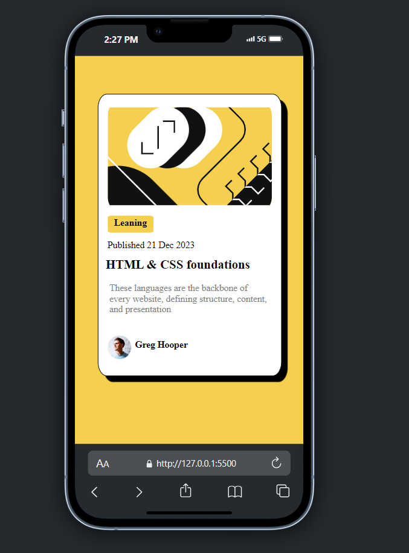
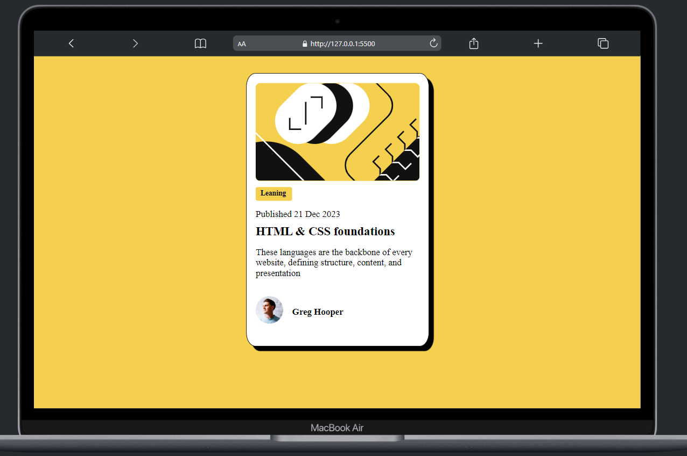

## Overview

### The challenge

Users should be able to:

- See hover and focus states for all interactive elements on the page

### Screenshot

### Links
- Live Site URL: [https://webdesign-multimedia.github.io/BlogPreviewCard/]

### Built with

- Semantic HTML5 markup
- CSS custom properties
- Media Quiere
- Mobile-first to desktop

## Author

- Website - [Julio](https://webdesign-multimedia.github.io/BlogPreviewCard/)
- Frontend Mentor - [@WebDesign-MultiMedia](https://www.frontendmentor.io/profile/WebDesign-MultiMedia)

